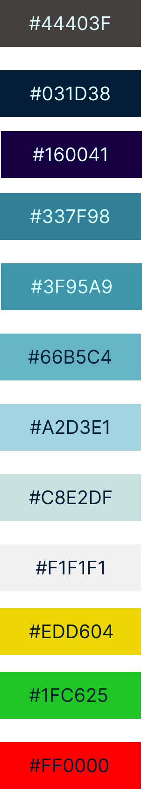
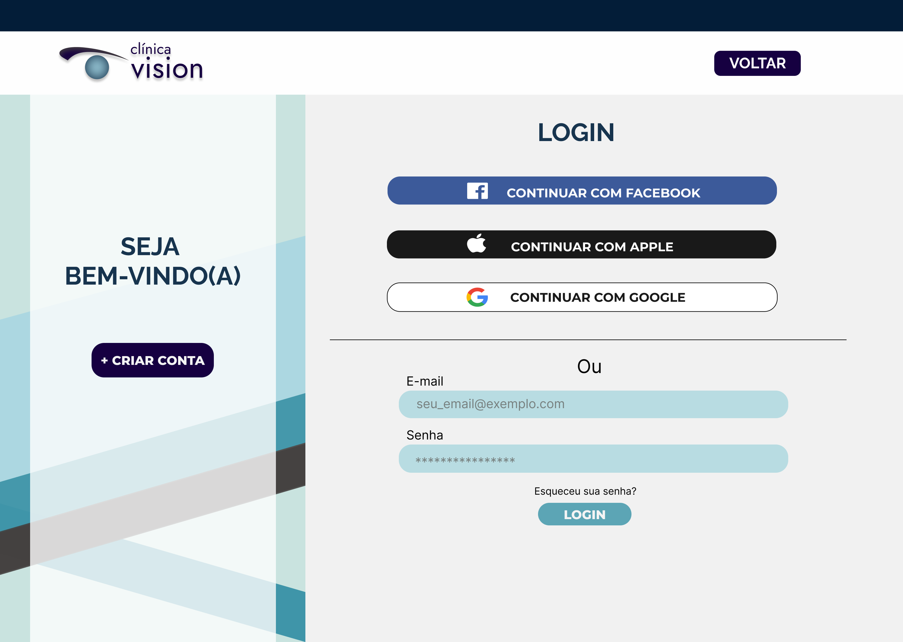
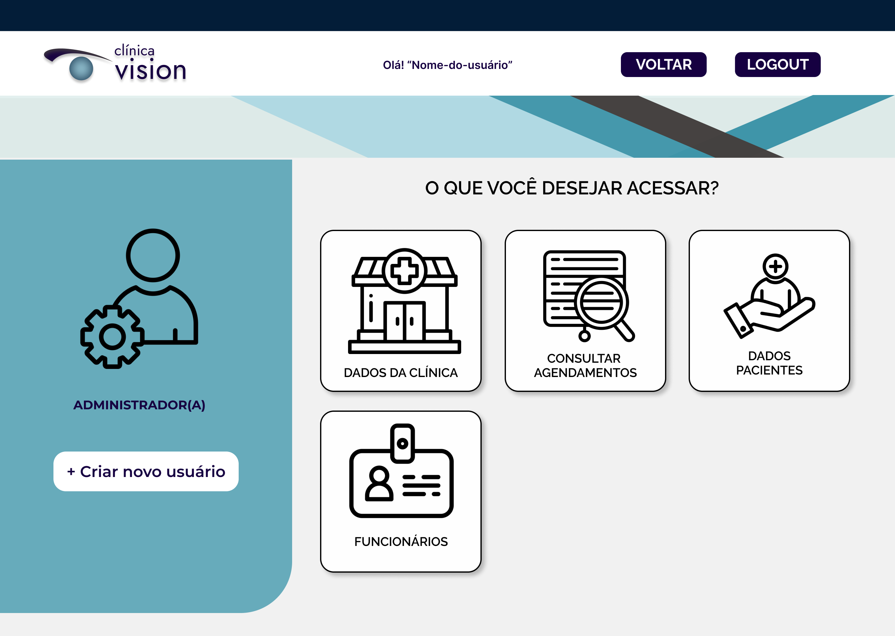
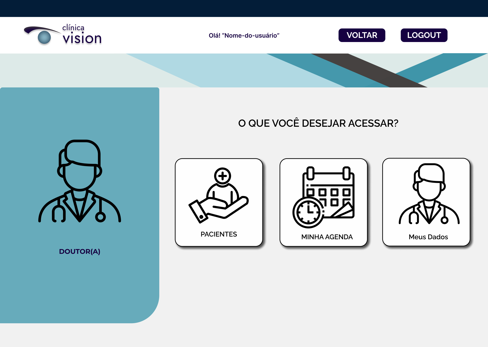
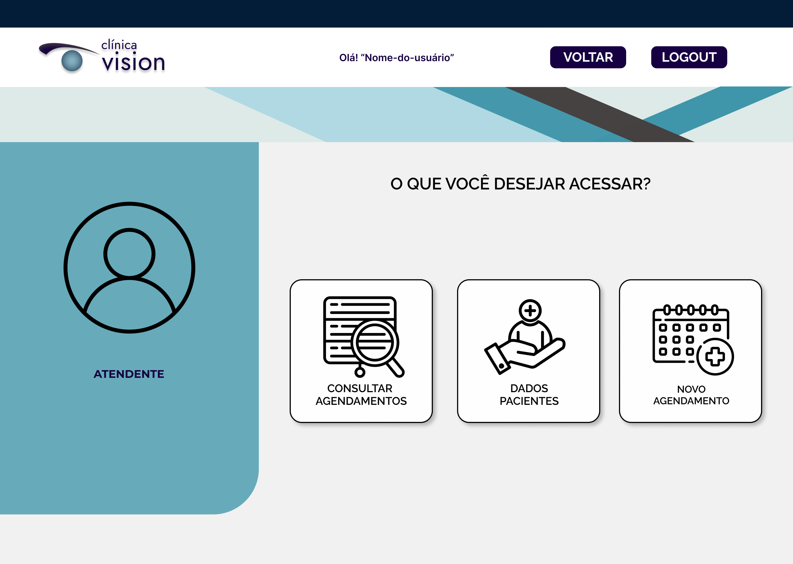
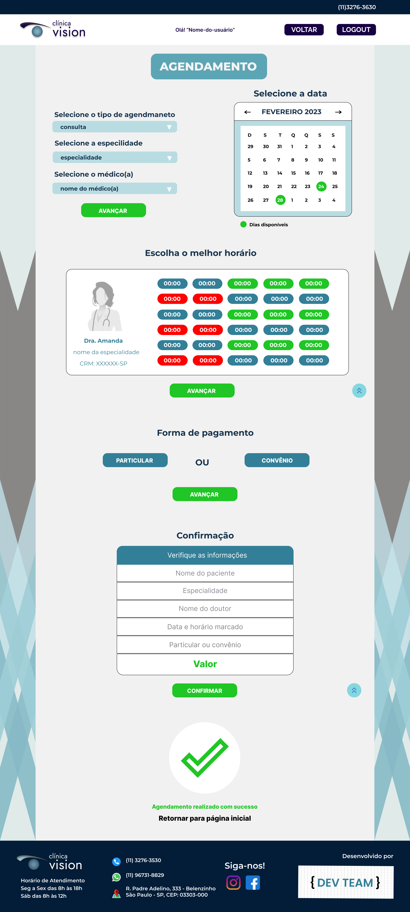

# Documentação da Clínica Vision

## Tipografia
- Título: Raleway font-size: 30px
- Subtítulo font-size: 20px
- Conteúdo: Montserrat font-size: 18px
- Descrições font-size: 16px
- Inputs heigth: 40px

``` html
<link rel="preconnect" href="https://fonts.googleapis.com">
<link rel="preconnect" href="https://fonts.gstatic.com" crossorigin>
<link href="https://fonts.googleapis.com/css2?family=Montserrat:wght@400;500;600;700&family=Raleway:wght@400;500;600;700&display=swap" rel="stylesheet">
```

``` css
font-family: 'Montserrat', sans-serif;
font-family: 'Raleway', sans-serif;
```

#### MOBILE - font-size
- Header font-size 14
- Título Font-size 16
- Subtítulo Font-size 14
- Descrição font-size 12

## Paleta de cores


## Login


No cabeçalho da página: o logo fica à esquerda, no meio a mensagem [Olá! “Nome-do-usuário“] e à direita o link (em formato de botão) [VOLTAR].

- Criar cadastro.
- Recuperar Senha.
- Login para acessar com Google, Facebook e Apple.
- Inputs: e-mail, senha.
- Botão Login

## Administrador

O administrador vai ter acesso a todos os dados e agendamentos.

Tendo opções para acrescentar, alterar ou excluir dados de funcionários, médicos, pacientes e da própria clínica. 

Quando clicar no card, será direcionado a dados mais completos.

### ACESSAR AGENDAMENTOS

Lista com todas as consultas e exames agendados.

Terá um botão para alterar agendamento ou cancelar.

## Acesso Funcionários
Vamos ter 2 opções de perfil (médico e atendente)

### Perfil Médico

- Visualização das consultas agendadas.

Data, hora e paciente.

- Prontuário.

Descrição das consultas e exames realizados, histórico médico de doenças de cada paciente.

### Perfil Atendente

- Banco de dados dos pacientes.

Nome, gênero, telefone, endereço, e-mail, convênio e CPF.

- Consultas e exames agendados - Permissão para agendar e cancelar (em caso de cancelamento descrição do motivo e quem solicitou).

Nome do paciente, médico, especialidade, convênio, data e hora.

## Convênios
Lista de convênios que serão atendidos na clinica.

- Unimed
- Notre Dame
- Green Line
- Amil
- Bradesco
- Porto Seguro

## Agendamento


O usuário poderá agendar suas consultas, exames através desta página.
