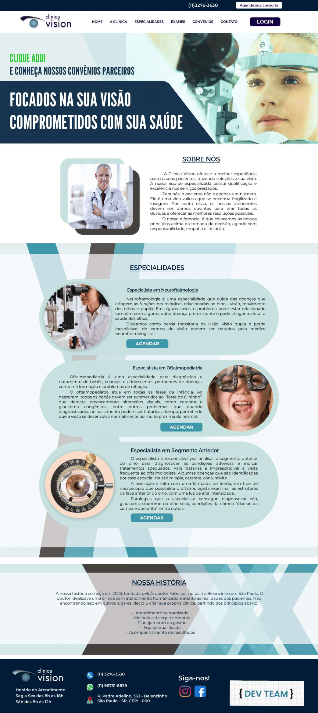

# Clínica Vision 

### Olá!

Somos a DEV TEAM! 
  [Caroline Santos](https://github.com/Caroline-Stos)
  [Yutty Takeyama](https://github.com/YuttyAkiko) 

A Clínica Vision nos contratou para desenvolver um sistema web integrado onde seja possível realizar a gestão da clínica de forma automatizada e ter acesso fácil aos dados sobre as informações de seus pacientes.

A Clínica Vision é uma empresa fictícia de pequeno porte que atua no ramo da
oftalmologia, foi criada pelo médico Dr. Johnny em 2023.
A empresa, por ser nova, iniciou a administração dos registros de forma simples, utilizando
softwares de planilhas eletrônicas e, com o sucesso da clínica, sua gestão passou a se tornar
complicada devido à alta demanda dos pacientes.

## Protótipo de alta fidelidade

